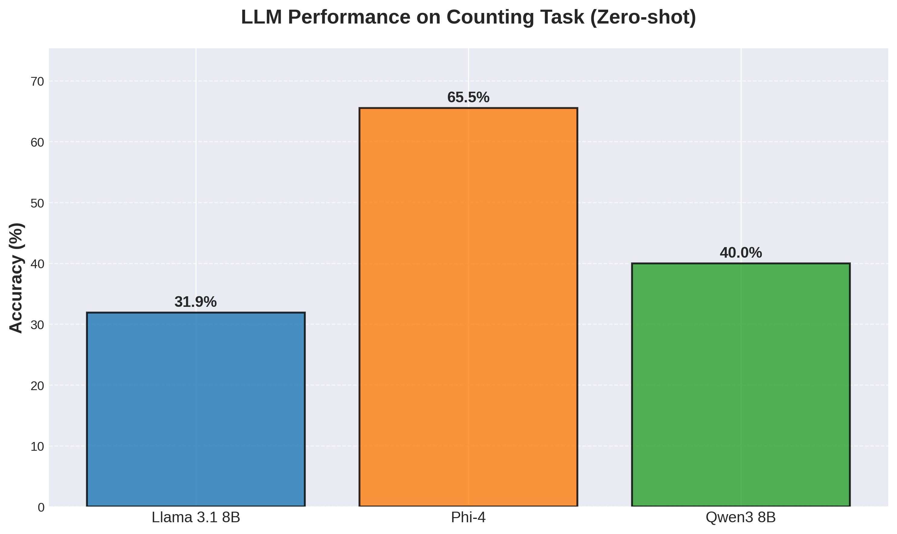
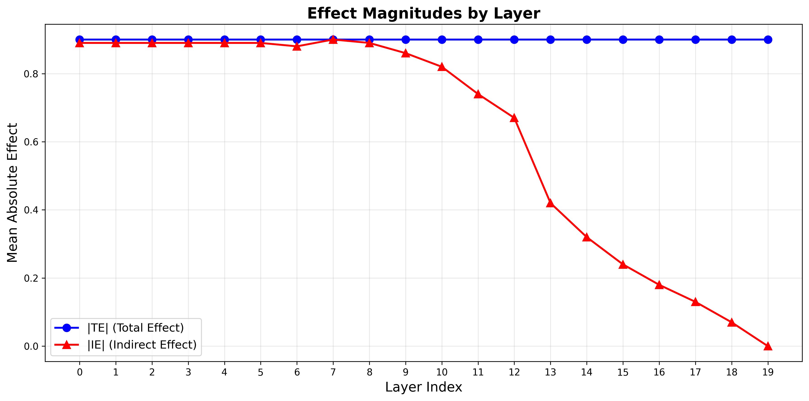
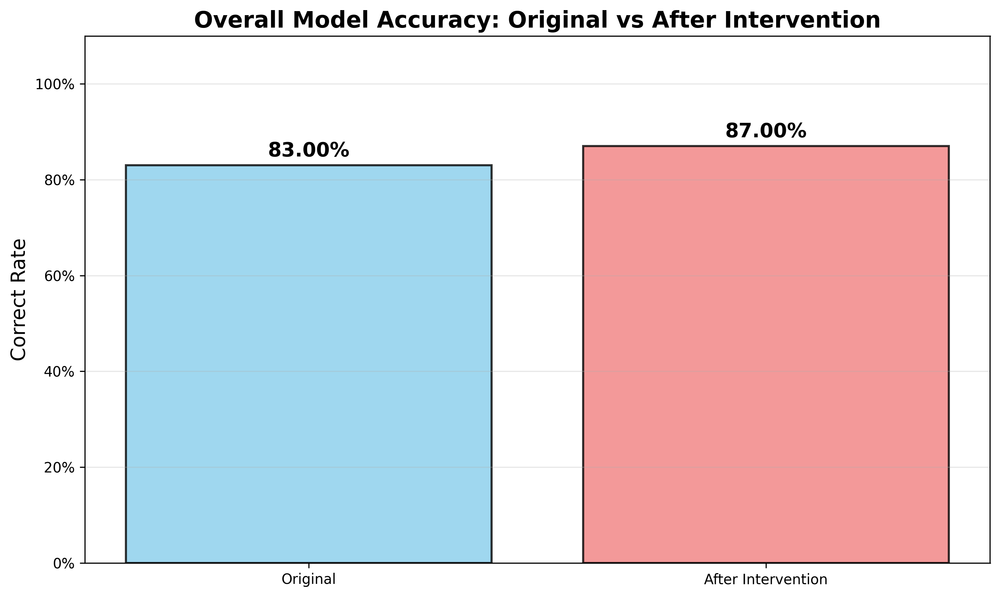
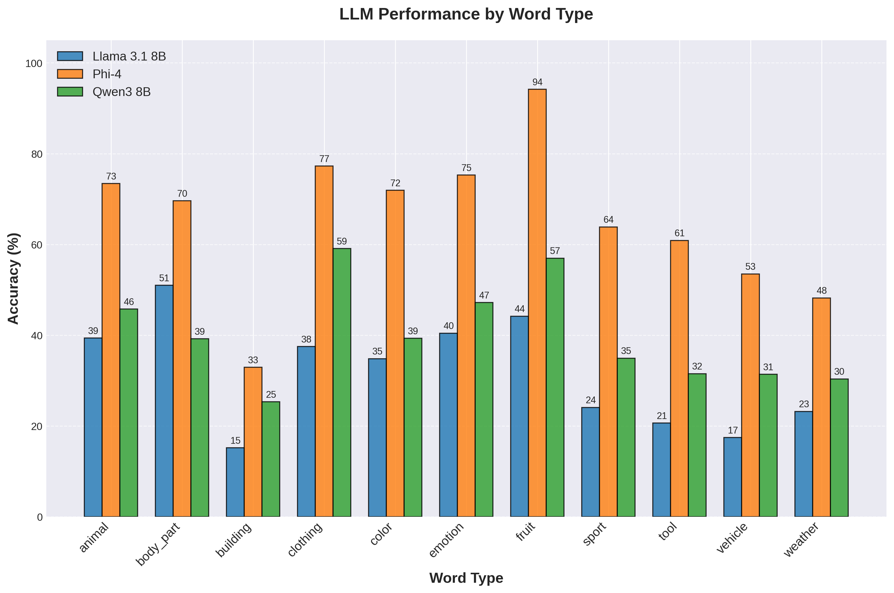

# LLM Counting Mechanisms: Behavioral Analysis and Causal Mediation

[](https://www.python.org/downloads/)
[](https://opensource.org/licenses/MIT)
[](https://pytorch.org/)
[](notebooks/)
[](data/)

A investigation into how Large Language Models (LLMs) process counting tasks, combining **behavioral benchmarking** with **causal mediation analysis** to understand the internal mechanisms of numerical reasoning.

## 📚 Quick Navigation

- 📁 **[Browse Data](data/)** - Complete experimental datasets and results
- 📝 **[Run Experiments](notebooks/)** - Original Google Colab notebooks
- 🐍 **[Use Code](src/)** - Python modules

## 🎯 Research Question

> **"Is there a hidden state layer that contains a representation of the running count of matching words, while processing the list of words?"**

This project addresses this question through experimentation using counterfactual activation patching.

## 📊 Key Findings

### Model Performance Comparison

<div align="center">
  
  <p><em>Zero-shot counting performance across different LLMs</em></p>
</div>

Our benchmark reveals significant performance differences across models
### Causal Mediation Results

<div align="center">
  
  <p><em>Causal effects reveal which layers mediate counting behavior</em></p>
</div>


<div align="center">
  
  <p><em>Model accuracy before and after counterfactual interventions</em></p>
</div>
### Important Methodological Note

> **⚠️ Chat Template Usage Difference**
>
> The **benchmark evaluation** and **causal mediation analysis** use different prompt formatting approaches, which explains accuracy differences for the same model:
>
> - **Benchmark**: Uses **raw model outputs without chat templates** to ensure fair comparison across different model families (since each model has different chat template formats)
> - **Causal Analysis**: Uses **Phi-4 with proper chat templates** for more controlled intervention analysis
>
> This methodological difference means Phi-4's accuracy in benchmark vs. causal analysis may differ, as chat templates can significantly impact model performance. The benchmark provides cross-model comparison, while causal analysis provides mechanistic insights.

## 🗂️ Project Structure

```
llm-counting-mechanisms/
├── src/
│   ├── data_generation.py      # Dataset creation with 11 word categories
│   ├── model_benchmark.py      # Zero-shot evaluation framework
│   ├── causal_analysis.py      # Counterfactual activation patching
│   └── visualization.py        # Result plotting and analysis
├── notebooks/                   # Original Colab notebooks (main experiments)
│   ├── 01_data_generation.ipynb   # Dataset creation notebook
│   ├── 02_model_benchmark.ipynb   # Multi-model evaluation notebook
│   └── 03_causal_analysis.ipynb   # Causal mediation analysis notebook
├── data/
│   ├── benchmark_results/              # Model evaluation data
│   │   ├── counting_dataset_5000.csv   # Main evaluation dataset
│   │   ├── word_banks.json             # Word categories
│   │   ├── llama3_1_8b_results.csv     # Llama 3.1 8B detailed results
│   │   ├── phi4_results.csv            # Phi-4 detailed results
│   │   ├── qwen3_8b_results.csv        # Qwen3 8B detailed results
│   │   ├── model_comparison.csv        # Cross-model comparison
│   │   └── benchmark_report.md         # Detailed analysis report
│   └── causal_results/                 # Causal mediation data
│       ├── cma_intervention_pairs.json # Intervention test cases
│       ├── cma_effects_results.csv     # Complete effect calculations
│       ├── cma_layer_statistics.csv    # Layer-wise statistics
│       └── cma_analysis_report.txt     # Causal analysis summary
├── results/
│   ├── figures/                      # All generated plots
│   ├── benchmark_results.csv         # Model performance data
│   └── causal_effects.csv           # Mediation analysis results
├── scripts/
│   ├── run_benchmark.py             # Complete benchmark pipeline
│   ├── run_causal_analysis.py       # Causal mediation pipeline
│   └── generate_plots.py            # Visualization generation
└── requirements.txt
```

> **📚 Note on Implementation**: The main experiments were conducted using **Google Colab** notebooks, which are available in the `notebooks/` directory. The `src/` directory contains refactored, production-ready Python modules for easy local reproduction and extension.

## 📁 Available Data

This repository includes **complete experimental data** from all conducted experiments:

### Benchmark Results (`data/benchmark_results/`)
- **Dataset**: 5,000 counting examples across 11 categories
- **Model Results**: Detailed predictions for Llama 3.1 8B, Phi-4, and Qwen3 8B
- **Comparisons**: Cross-model performance analysis
- **Reports**: Comprehensive benchmark analysis

### Causal Analysis Data (`data/causal_results/`)
- **Intervention Pairs**: 3,000+ counterfactual test cases
- **Effect Calculations**: Total Effect (TE) and Indirect Effect (IE) by layer
- **Layer Statistics**: Mediation strength across all transformer layers
- **Analysis Reports**: Detailed causal mediation findings

> ⚡ **Ready for Analysis**: All data files are included, so you can immediately reproduce plots and analysis without running the computationally expensive model evaluations.

## 🚀 Quick Start

### Two Ways to Run Experiments

#### Option 1: Google Colab Notebooks (Original Implementation)
The main experiments were conducted using Google Colab for GPU access. Use the notebooks in `notebooks/` directory:

1. **Data Generation**: `notebooks/01_data_generation.ipynb`
2. **Model Benchmark**: `notebooks/02_model_benchmark.ipynb` 
3. **Causal Analysis**: `notebooks/03_causal_analysis.ipynb`

These notebooks include all the original experimental code and can be run directly in Google Colab.

#### Option 2: Local Python Scripts (Refactored)
For local reproduction and extension, use the modular Python code:

### Installation
```bash
git clone https://github.com/your-username/llm-counting-mechanisms.git
cd llm-counting-mechanisms
pip install -r requirements.txt
```

### Generate Dataset
```python
from src.data_generation import CountingDataGenerator

generator = CountingDataGenerator()
dataset = generator.create_dataset(size=5000)
generator.save_dataset(dataset, "data/counting_dataset_5000.csv")
```

### Run Benchmark
```python
from src.model_benchmark import CountingBenchmark

# Note: Benchmark uses raw model outputs (no chat templates)
# for fair cross-model comparison
benchmark = CountingBenchmark("data/counting_dataset_5000.csv")
results = benchmark.evaluate_models([
    "meta-llama/Meta-Llama-3.1-8B-Instruct",
    "microsoft/phi-4", 
    "Qwen/Qwen3-8B"
])
```

### Causal Analysis
```python
from src.causal_analysis import CausalMediationAnalyzer

# Note: Causal analysis uses chat templates for controlled interventions
analyzer = CausalMediationAnalyzer("microsoft/phi-4")
effects = analyzer.run_analysis("data/intervention_pairs.json")
```

## 🔬 Methodology

### Dataset Design
- **11 semantic categories**: fruit, animal, vehicle, color, body_part, tool, clothing, sport, building, weather, emotion
- **Uniform distribution**: Equal probability for each possible count (0 to list_length)
- **Variable list lengths**: 5-10 words per list
- **5,000 examples** for robust statistical analysis

### Evaluation Protocol
- **Zero-shot**: No reasoning tokens or chain-of-thought
- **Controlled formatting**: Consistent prompt structure across models
- **Extraction method**: Regex-based numerical answer parsing

### Causal Mediation
- **Intervention method**: Counterfactual activation patching
- **Target**: Single word replacement (target → distractor)
- **Measurements**: Total Effect (TE) and Indirect Effect (IE)
- **Layer coverage**: All transformer layers analyzed
- **Model**: Phi-4 with chat template formatting for consistent intervention analysis

## 🛜️ Technical Details

### Development Environment
- **Primary Platform**: Google Colab (for GPU access and reproducibility)
- **Local Development**: Python 3.8+ with pip package management
- **Notebooks**: Original experimental code available in `notebooks/` directory
- **Scripts**: Refactored production code in `src/` directory

### Key Dependencies
- `transformers>=4.30.0`
- `torch>=1.9.0`
- `pandas>=1.5.0`
- `matplotlib>=3.5.0`
- `tqdm>=4.60.0`

### Model Support
Currently supports HuggingFace transformer models:
- Llama family (requires access token)
- Phi family
- Qwen family
- Gemma family (with modifications)

### Hardware Requirements
- **GPU**: NVIDIA GPU A100
- **CPU**: Multi-core processor for data processing
- **Memory**: 32GB+ RAM for large model analysis

## 📄 License

This project is licensed under the MIT License - see the [LICENSE](LICENSE) file for details.

---

**Keywords**: Large Language Models, Causal Mediation Analysis, Numerical Reasoning, Mechanistic Interpretability, Transformer Analysis

## 📸 Additional Results

<details>
<summary>Click to view detailed performance breakdown by category</summary>

<div align="center">
  
  <p><em>Model performance across different word categories</em></p>
</div>

</details>
